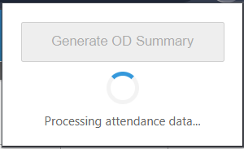
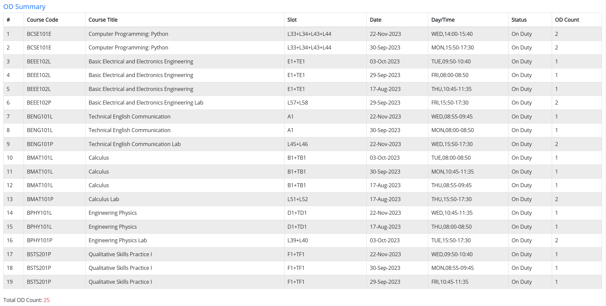

# ezOD

A Chrome extension that automatically generates an On Duty (OD) attendance summary table from VTOP's attendance page.

## Installation

### Manual Installation
1. Download or clone this repository
2. Open Chrome and navigate to `chrome://extensions/`
3. Enable "Developer mode" (toggle in top-right corner)
4. Click "Load unpacked" and select the extension folder

### Chrome Web Store
*(Coming soon...)*

## Usage
1. Log in to [VTOP](https://vtopcc.vit.ac.in/vtop/login)
2. Navigate to **Attendance** section, select the semester and click on the `View` button
3. Click extension icon in toolbar
4. Click "Generate OD Summary" button
5. Wait while processing
6. View results directly below attendance table

## Contributing
- Feel free to open relevant issues and PRs
1. Fork the repository
2. Create feature branch (`git checkout -b feature/improvement`)
3. Commit changes (`git commit -am 'Add some feature'`)
4. Push to branch (`git push origin feature/improvement`)
5. Open Pull Request
